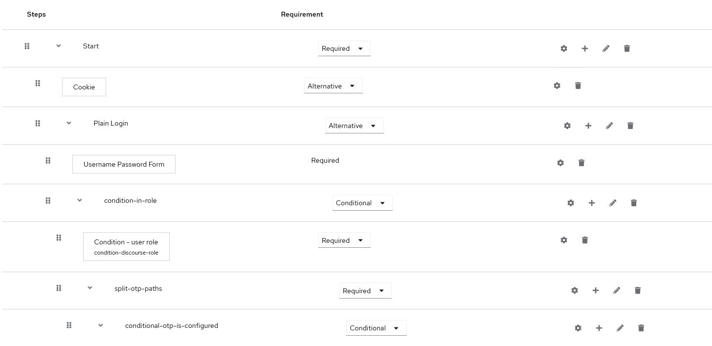
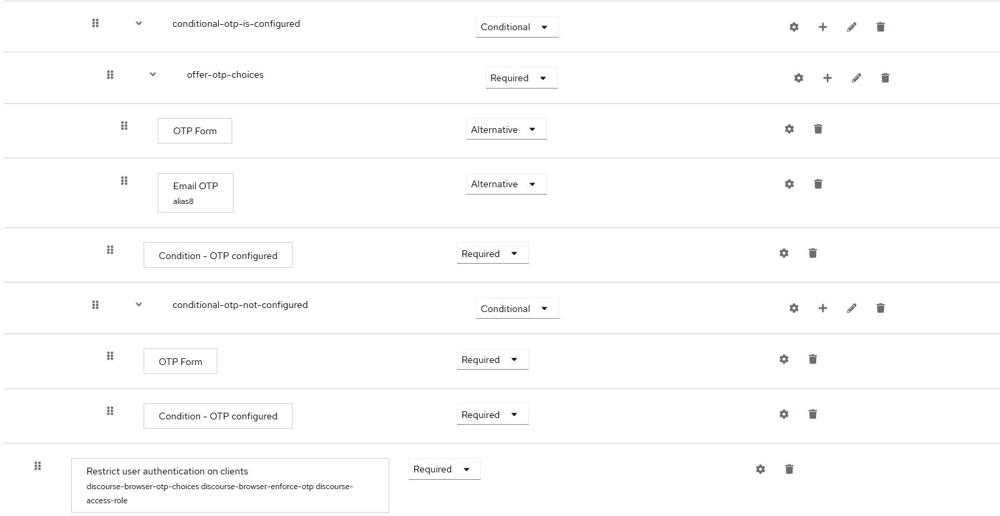

This is mostly the work of Karelics, I simply adjusted the authenticator to check wheter the user has an otp configured

https://github.com/Karelics/keycloak-authentication-extensions/tree/main

This is my current usage case for which I needed this kind of authenticator.

Basically the idea is to require the client to setup otp.
Once the client has the otp configured email otp is presented as an alternative.

